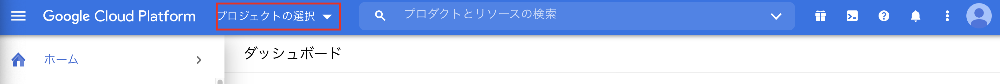
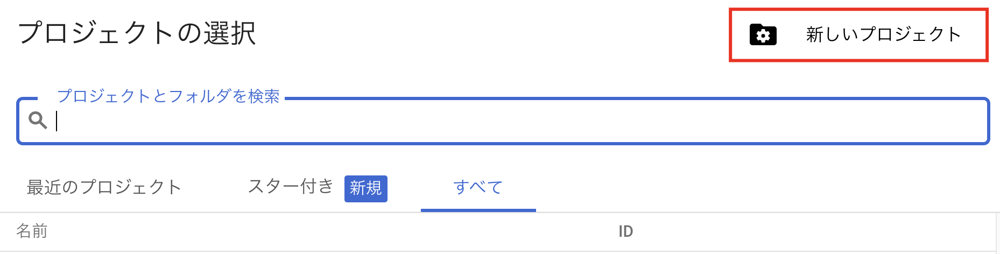
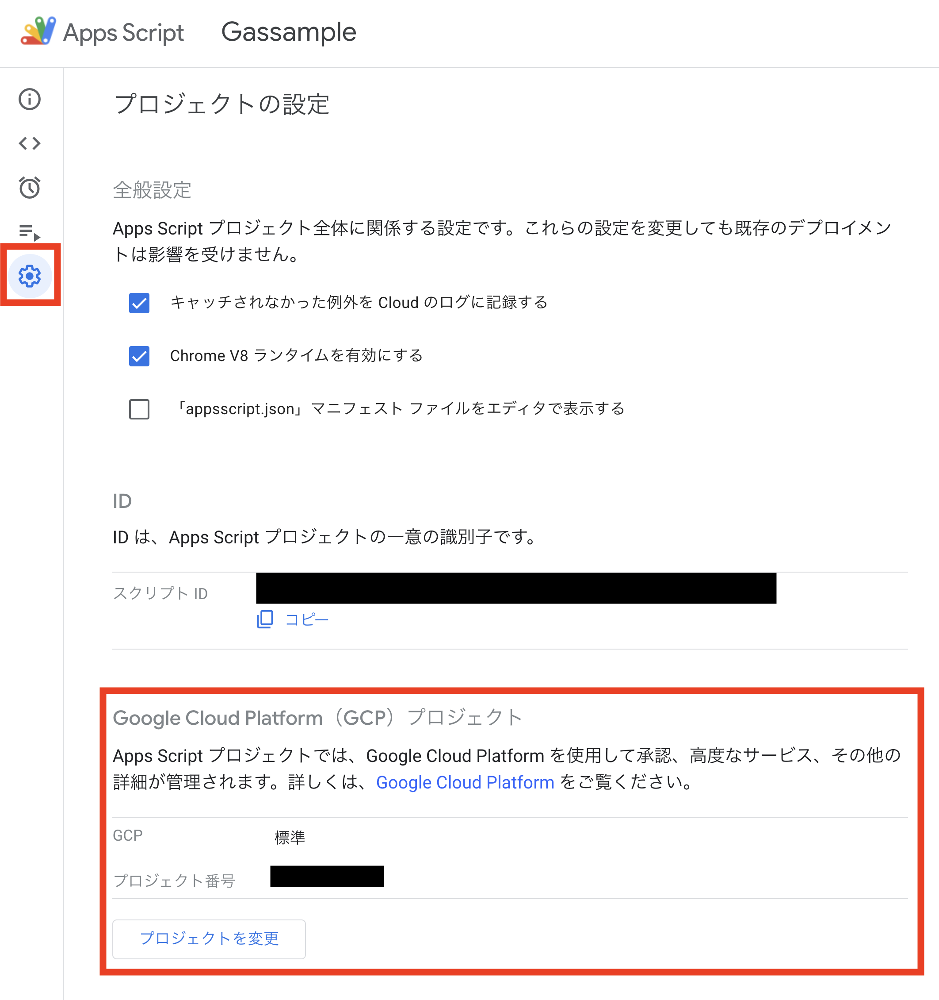
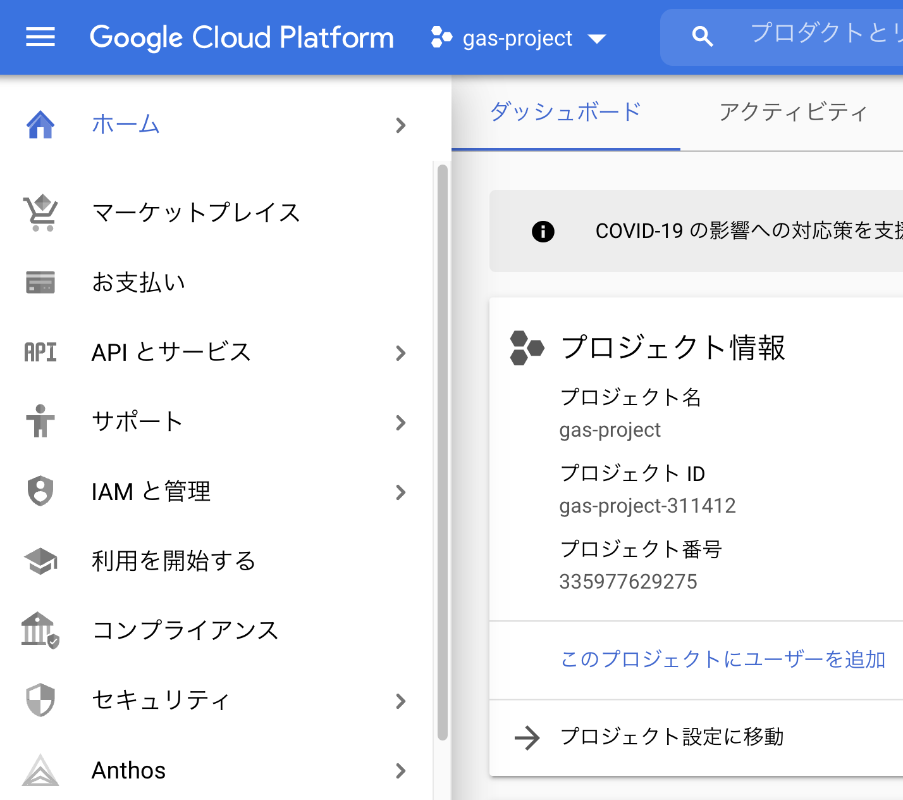

# デプロイする前の実行確認とログの確認
これまでの作業でコーディング〜デプロイ、動作確認までローカルでできるようになりました。
ですが現状では以下の問題があります。
- 動作確認をするのに毎回デプロイが必要
- console.logなどのログがローカルから確認できない

これらは
- clasp run（pushされているコードを実行）
- clasp logs(ログの出力) 
コマンドが利用できれば解決しますが、そのためにはGCPの設定が必要です。
ややこしい作業が多くなるので、そこまで求めないという方は本章の作業はしなくても問題ありません。

# GCPプロジェクトの作成
最初に実行したclasp login で認証したアカウントでGCPプロジェクトを作成します
https://console.cloud.google.com/

リンク先から プロジェクトの作成>新しいプロジェクト を選択し
プロジェクト名：任意
場所：任意
で新しいGCPプロジェクトを作成します



# Oauthの同意設定
Oauthの同意設定が必要です。
GCPのダッシュボードに作成したGCPのプロジェクトIDが表示されているはずなのでそれをコピーし以下のリンクを開きます。
`https://console.developers.google.com/apis/credentials/consent?project=[PROJECT_ID]`

1. ラジオボタンで 外部を選択し 作成ボタンをクリック
2. アプリ情報の入力
   - アプリ名:任意
   - ユーザサポートメール:任意
   - メールアドレスを設デベロッパーの連絡先情報：任意
    を指定して次へ
3. スコープは指定なしで次へ
4. テストユーザーに最初に実行した`yarn run clasp login`で認証したアカウントのメールアドレスを追加して次へ
概要画面が表示されたらOauthの同意設定は完了です。

# claspにプロジェクトIDを設定
claspにプロジェクトIDを設定します
まず以下のコマンドを打ち.clasp.jsonにprojectIdを設定します
```sh
clasp setting projectId <作成したGCPのプロジェクトID>
```

次に`yarn run clasp open`でGASエディタを開き、設定ボタンからGCPプロジェクト番号（プロジェクトIDではないので注意）を設定します。



# 認証情報を作成
`https://console.cloud.google.com/apis/credentials?project=[PROJECT_ID]`
から認証情報ファイルの作成します
1. 認証情報を作成> OauthクライアントID を選択
2. OAuth クライアント ID の作成
   - アプリケーションの種類：デスクトップアプリ
   - 名前：任意
3. ファイルをダウンロードし、creds.jsonという名前でプロジェクト直下に配置
    
4. `clasp login --creds creds.json`を実行するとブラウザで認証画面が開くので、認証 > 権限許可 を行う

# 実行可能APIとしてデプロイ
これでclasp run/clasp logsを使う環境が整いました。
しかしclasp runを実行するにはウェブアプリではなく実行可能APIとしてデプロイしておく必要があるのでその設定を入れます。
まずappscriot.jsonに実行可能APIとデプロイ設定をを追加します。
```diff json:appscriot.json
+  "executionApi": {
+    "access": "ANYONE"
+  }
```

そうしたらデプロイを実行します
```sh
yarn deploy-develop
```

これで以下を実行して結果が帰って来ればOKです。
clasp run ではreturnJsonのすおりを通す必要がないのでexecuteDoGet/executeDoPostを指定します
```sh
clasp run executeDoGet
clasp run executeDoPost
clasp logs
```